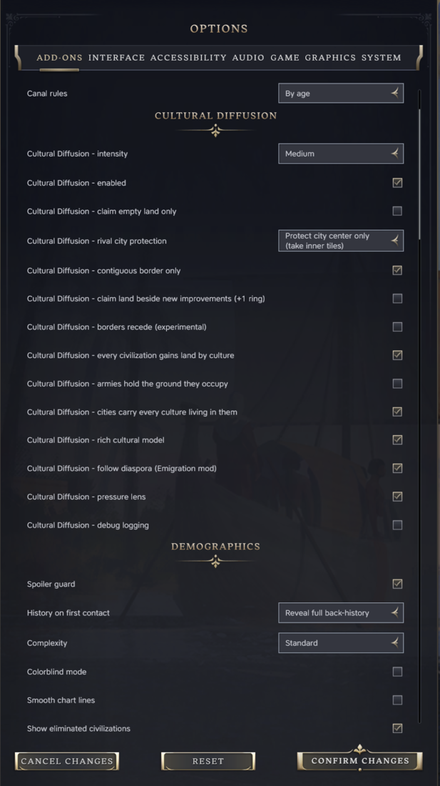
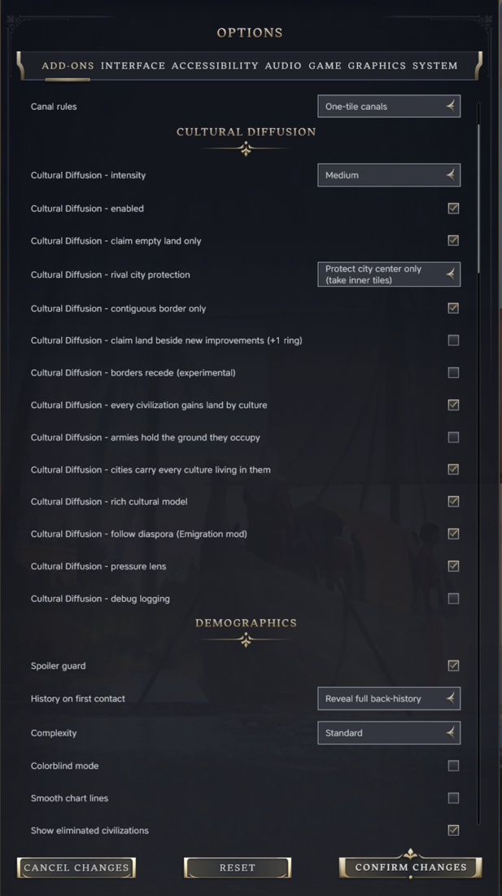
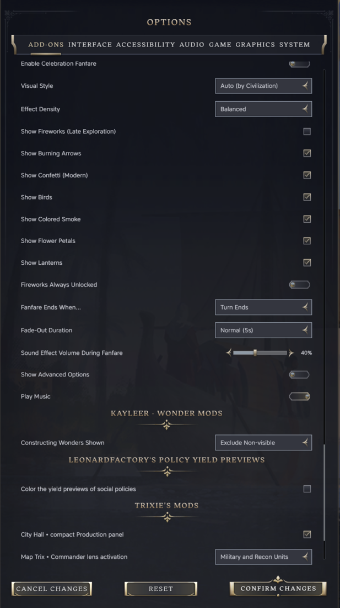
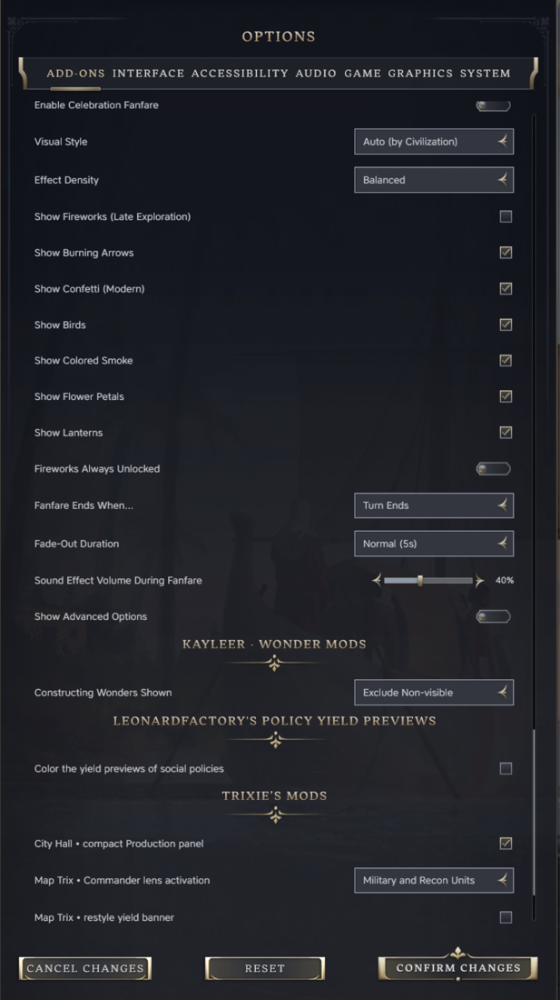
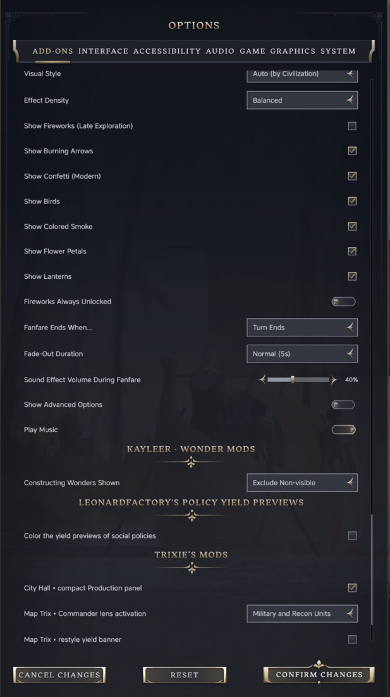
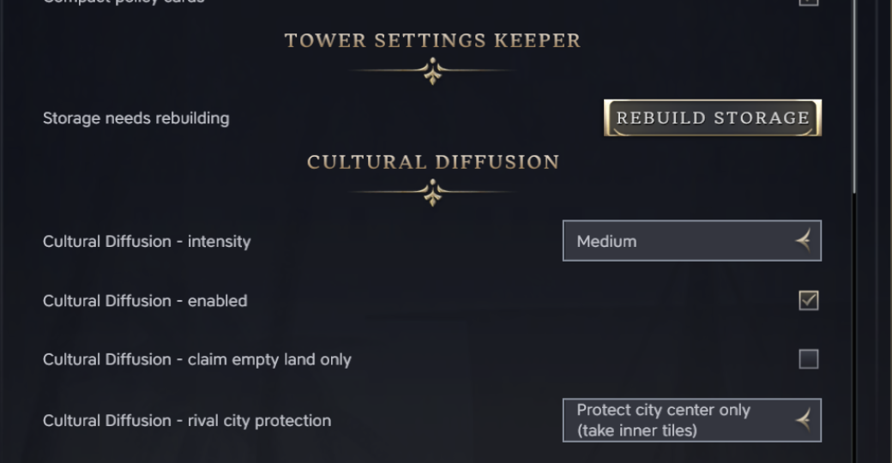

# Tower Settings Keeper

一个《文明VII》Mod。安装后，你在其他 Mod 中设置的选项在重启游戏后仍然保留。它没有自己的选项，也不改变游戏玩法。

## 问题所在

Mod 把设置保存在游戏的 `localStorage` 中。在《文明VII》1.5.0 里，这个存储有一个缺陷：无论请求的是哪一条记录，读取总是返回存储中的第一条记录，而且没有办法列出所有记录。只有当某个 Mod 的记录恰好排在最前面时，它才能读到自己的设置。其他每个 Mod 读到的都是别的 Mod 的数据，把它当成自己的，并在下次保存时以自己的名字写回去。

玩家看到的现象是：选项面板在每次启动后重置，有时一个 Mod 的设置会出现在另一个 Mod 里。

大多数选项面板共用一条名为 `modSettings` 的记录，每个 Mod 占一个区块。此外，创意工坊中约有五十个 Mod 带有一段辅助代码，一旦发现第二条记录就会清空整个存储。只要有一个 Mod 把设置存在自己的记录里，下次保存时其他所有 Mod 的设置就会被清掉。

## 这个 Mod 做什么

它把所有记录都保存在游戏能够读取的唯一一行中，并从该行应答对 `localStorage` 的所有调用。

- 使用自己键名的 Mod，其数据会以该键名保存并读回。
- 共用记录 `modSettings` 和以前一样工作，每个 Mod 一个区块，现有的选项面板无需改动。
- 存储始终只报告一条记录，因此清空存储的辅助代码永远不会运行。
- 如果其他 Mod 已经把存储的顺序打乱，本 Mod 会把能识别的记录移到正确位置，其余的一律不动，并在每次启动时重新检查。

其他 Mod 不需要更新。它可以直接与创意工坊里已有的 Mod 一起使用。

## 适用于所有 Mod，无需改动

本 Mod 为所有保存设置的 Mod 解决这个问题，这些 Mod 保持原样即可。Mod 作者不必修改任何东西，也不需要登记。安装本 Mod 的玩家，其所有 Mod 的设置会一次性全部正常工作。

Mod 作者还有一个额外选项：把同一个文件放进自己的 Mod 中一起发布，这样即使玩家从未安装本 Mod，也能受到保护。下文"致 Mod 作者"一节有说明。内置该文件的 Mod 与本 Mod 可以同时安装。只有一份副本会运行，也就是最新的那份，其余的什么都不做。

## 截图

在主菜单中更改选项，重启后在选项界面读回：

| 更改前 | 更改后 | 重启后 |
|---|---|---|
|  |  |  |

在游戏中更改选项，再次重启后在菜单和游戏中读回：

| 游戏内，更改前 | 游戏内，更改后 | 菜单，重启后 | 游戏，重启后 |
|---|---|---|---|
|  |  |  |  |

其他 Mod 不只是显示保存的值，还会实际使用它们。把 Map Trix 的"Commander lens activation"设为"Military and Recon Units"并保存后，在新的进程中选中侦察兵会开启指挥官透镜，而默认设置下不会：

在 1.5.0 上与 28 个 Mod 一起测试，包括 Map Trix、City Hall、Celebratory Celebrations、Wonders Screen Continued、Better Ribbon Info、Compact Policy Cards、History and Rankings、一个设置管理器和 AutoMissionary。完整记录见 [docs/design.md](../design.md)（英文）。

## 安装

在 Steam 创意工坊订阅，或从最新版本下载 zip，解压到 `~/Library/Application Support/Civilization VII/Mods/`（macOS）或 `%LOCALAPPDATA%\Firaxis Games\Sid Meier's Civilization VII\Mods\`（Windows）。然后在"附加内容"中启用。没有任何需要配置的地方。

## 须知

- 从现在起保存的设置都会保留。安装本 Mod 之前丢失的设置已经没有了，除非它们仍以本 Mod 能识别的记录留在磁盘上。
- 如果存储原本就已损坏，本 Mod 不会猜测无法识别的记录是哪个 Mod 写的。如果那条记录是仅剩的一条，本 Mod 会围绕它重建存储并保留其内容。记录的名字会丢失；之后能识别该内容的版本会把它放回正确的名字下。如果有两条或更多这样的记录挡在前面，本 Mod 会在它们之前建立新的根记录，把它们留在磁盘上，并在下次启动时再试。它绝不会覆盖其他 Mod 的数据。
- 游戏不保证 Mod 脚本的运行顺序。如果某个 Mod 在自己的脚本加载的那一刻、在本 Mod 运行之前就读取设置，那么在那一次启动中它看到的仍是旧行为。迄今所有测试启动中，本 Mod 都是最先运行的。
- 本 Mod 自己的文本已翻译成游戏支持的全部十一种语言。
- 存储有 4 MB 的大小上限，是 28 个 Mod 所占 0.5 MB 的八倍。试图超过它的 Mod 只有那一次写入被拒绝，并保留其之前的设置，同时"选项，附加组件"中会出现一行"已达到存储上限"，指出该 Mod 的名字。其他一切不受影响。见下文"负载与上限"。
- 屏幕上不会出现任何东西，只有 `Logs/UI.log` 中一行以 `[settings-keeper] ready:` 开头的记录。唯一的例外是上面所说的备用情况：此时"选项，附加组件"中会出现一行"重建存储"。按下并确认后，本 Mod 无法识别的记录会被删除，存储会作为一条记录写回。存储恢复正常后，这一行就会消失。

  | 仅在需要时显示的行 | 确认框 |
  |---|---|
  |  |  |

## 负载与上限

所有内容都在一行里，所以要关注的就是这一行的大小。在测试机上安装 28 个 Mod 时，这一行约为 0.5 MB，几乎全部是某一个 Mod 的游戏历史。一个选项面板只增加几百字节。一次写入会序列化整行，在这个大小下约 8 ms，每个任务只做一次，不论其中写入多少个值。Mod 的数量本身无关紧要，关键是它们存了多少。

为了找到引擎在哪里撑不住，一个探针在装有同样 28 个 Mod 的"立即开始"游戏中，通过本 Mod 让这一行每步增长 1 MB，并用单独的启动分别测试各个环节。

| 行大小 | 一次写入（序列化并存储） | 写入后读取一个键 |
|---|---|---|
| 0.5 MB，真实存储 | 8 ms | 2 ms |
| 5 MB | 71 ms | 20 ms |
| 10 MB | 101 ms | 64 ms |
| 13 MB | 141 ms | 67 ms |
| 一次写入 16 MB | 102 ms | |
| 20 MB，每次增加 1 MB | 197 ms | |

在任何大小下都没有丢失或损坏，存储始终是一行。有上限的是游戏进程本身。当这一行被连续多次读取并重写时，它在 14 MB 那一步停止了，没有崩溃报告；只重写时则在 21 MB 那一步停止。一个 14 MB 的存储能在主菜单和游戏中加载，所有键都可读，但在这一行再被读取并重写一次后停止了。停止时进程占用 1.9 GB，所以上限是游戏的内存，不是存储。

因此本 Mod 拒绝任何会使这一行超过 4 MB 的写入，这是游戏停止的最低大小的四分之一。被拒绝的写入会抛出与浏览器 localStorage 已满时相同的 `QuotaExceededError`，面向 Web API 编写的 Mod 已经知道它的含义。该 Mod 之前的值保留，其他 Mod 不受影响，日志记录 Mod 名称和大小，"选项，附加组件"显示一行"已达到存储上限"，内容相同，并有一个"确定"可以清除它。上限是 `ui/settings-keeper.js` 开头的一个常量。

## 移除本 Mod

通常无需做任何事。存储只有一行，所以游戏会像以前一样先读取 `modSettings`，其他 Mod 能找到自己的区块。多出来的只是几个它们会忽略的内部字段。如果"选项"中显示"重建存储"这一行，请在停用本 Mod 之前先按下它。否则其他 Mod 的辅助代码会在下次保存时清空存储。

## 致 Mod 作者

你不需要做任何事。无论你的 Mod 使用共用记录 `modSettings` 还是自己的键名，在安装了本 Mod 的环境中，你的 Mod 的设置都能正常工作。

如果你希望玩家不必安装本 Mod 也能受到保护，可以把这个修复放进你自己的 Mod 中。只需一个文件和 modinfo 中的两行，你的设置代码保持不变。说明见 [embed/README.md](../../embed/README.md)（英文），也可以从最新版本获取 `settings-keeper-embed-<version>.zip`。

## 许可

MIT。
